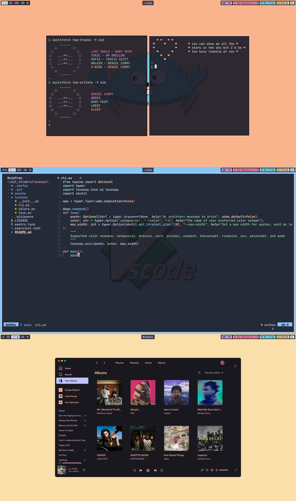

<h2 align="center"> ━━━━━━  ❖  ━━━━━━ </h2>

<!-- BADGES -->
<div align="center">
   <p></p>
   
      

      

   
   
   
   <br>
</div>

</p>

---

<!-- INFORMATION -->
### ❖ Information 
   

   Hello gamers and gamern'ts! Looks like you've stumbled upon my dotfiles, have fun exploring!.

   Here is (almost) everything I use:

   - **OS:** [MacOS](https://www.apple.com/macos)
   - **WM:** [yabai](https://github.com/koekeishiya/yabai)
   - **Hotkeys:** [skhd](https://github.com/koekeishiya/skhd)
   - **Panel:** [simple-bar](https://github.com/Jean-Tinland/simple-bar)
   - **Terminal:** [kitty](https://github.com/kovidgoyal/kitty/)
   - **Shell:** [zsh](https://www.zsh.org/)
   - **Prompt:** [starship](https://starship.rs/)
   - **Greeting:** [lovesay](https://github.com/ZenithDS/lovesay)
   - **Editor:** [neovim](https://github.com/neovim/neovim/)
   - **Multiplexer:** [tmux](https://github.com/tmux/tmux) or [kitty](https://github.com/kovidgoyal/kitty/)
   - **Top:** [bpytop](https://github.com/aristocratos/bpytop)
   - **Theme:** [catppuccin](https://github.com/catppuccin)
   - **Spotify:** [spicetify](https://github.com/khanhas/spicetify-cli)
   - **Browser:** [brave](https://brave.com/)
   - **Browser Startup:** [nightTab](https://github.com/zombieFox/nightTab)
   - **PDF Viewer:** [zathura](https://github.com/pwmt/zathura)
   - **Application Launcher:** [Alfred](https://www.alfredapp.com/)
   

### ❖ Mystery-Section 
   - You might be wondering, "What is this section for?" I'm afraid you'll have to keep wondering :)

<br>

---

<!-- SETUP -->
### ❖ Installation and Setup

   There is no real way to easily replicate this setup. As such, I've decided not to include any install scripts or detailed instructions on how to get my config working on your machine.
  
   I will however, leave a few helpful tips if you deem my config worthy of copying anyways.

   <details>
   <summary><strong>WM and Hotkeys</strong></summary>
   
   > Installing yabai and skhd tends to be a little bit more involved than just installing them from brew. Follow the instructions [here](https://github.com/koekeishiya/yabai/wiki).

   > I also have caps-lock bound as my **hyper** key. On MacOS, you can do the same by using [karabiner](https://karabiner-elements.pqrs.org/).

   </details>

   <details>
   <summary><strong>Nerd Fonts</strong></summary>
   
   > A lot of the programs mentioned earlier make use of nerd fonts, so here's how to install the one I use on MacOS.
   ```sh
   brew tap homebrew/cask-fonts
   brew install --cask font-jetbrains-mono-nerd-font
   ```

   </details>
   
   <details>
   <summary><strong>Kitty</strong></summary>
   
   > Window decorations for Kitty are turned off since I use a tiling WM. You may want to adjust that setting if you're not using a tiling WM.

   </details>
   
   <details>
   <summary><strong>Zsh</strong></summary>

   > A zsh directory can be stored in `~/.config/zsh/` by adding the following to `~/.zshenv`
   ```sh
   ZDOTDIR=$HOME/.config/zsh
   ```
   
   > The zsh config uses starship and fzf
   ```sh
   brew install starship fzf
   ```

   > The config also assumes that the `.fzf.zsh` file is in `~/.config/fzf/`


   > The zsh-functions file is used for plugins, so it's important to keep it in your `zsh` directory.

   > zsh might throw a warning about insecure directories, this can be resolved by running the following command.
   ```sh
   compaudit | xargs chmod g-w
   ```

   </details>
   
   <details>
   <summary><strong>Neovim</strong></summary>
   
   > The nvim config is relatively polished, you can be up and running in just a few minutes using the following commands.
   ```sh
   # Remove old nvim data
   rm -rf ~/.local/share/nvim
   rm -rf ~/.cache/nvim
   
   # Backup old nvim config
   mv ~/.config/nvim ~/.config/old_nvim

   # Copy new config
   cp -R ~/dotconfig/.config/nvim ~/.config 
   ```
   > Nvim will install [packer](https://github.com/wbthomason/packer.nvim) and all the plugins automatically the first time it is opened.
  
   > Once packer is done installing all the plugins, simply exit nvim and open it again. Voila! you now have a baller nvim config. 

   > if you're using the vscode-neovim plugin for vscodium/vscode, the key repeat can be turned on by using the following command on MacOS
   ```sh
   defaults write -app VSCodium ApplePressAndHoldEnabled -bool false # VSCodium
   defaults write com.microsoft.VSCode ApplePressAndHoldEnabled -bool false # VSCode 
   ```

   </details>
      
   <details>
   <summary><strong>Misc</strong></summary>
   
   > Everything else should be fairly easy to configure, but feel free to open an issue if that's not the case.

   </details>

---
### ❖ A few words

- I fell down the rabbit hole of customization when I was first introduced to vim in my intro to CS class. I've come a long way since then, and my taste continues to evolve as I progress through college. This repo is almost a way for me to document my growth. In hopes that maybe one day, I'll run through the commit history and laugh at all the mistakes I made and maybe even be impressed.
- To anyone that stumbles across this repo in their journey to making their computer feel like home, **Happy Ricing :)** 

---

### ❖ Acknowledgements

   - **Inspiration**
      - [janleigh](https://github.com/janleigh/dotfiles) for the README style.
      - [catppuccin](https://github.com/catppuccin) for the colors and the badge style.


