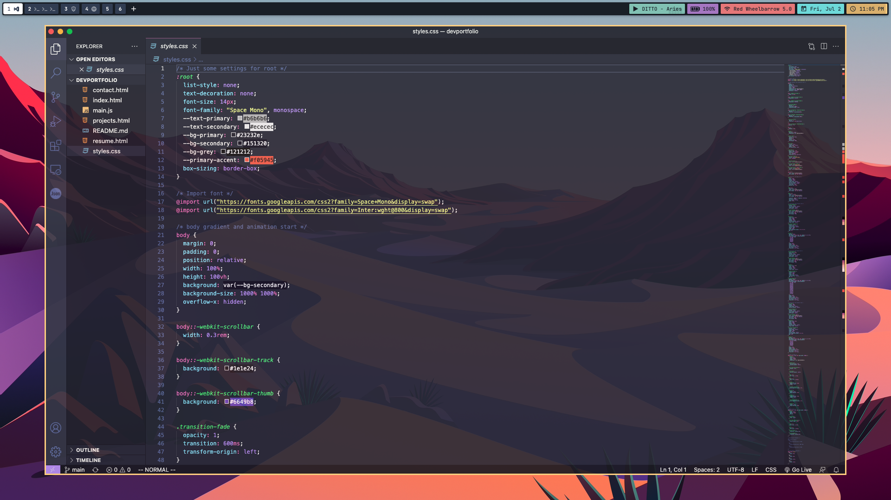
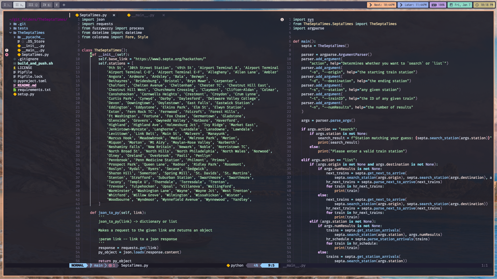
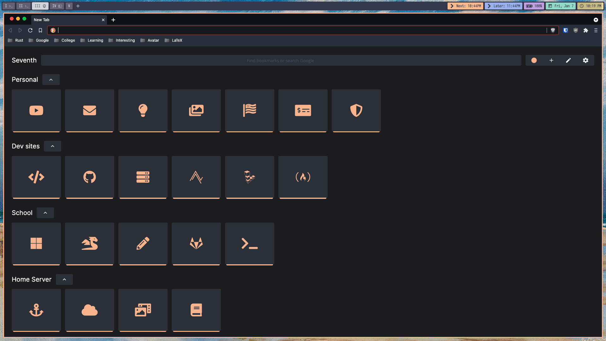

# MacOS dotfiles

As someone who recently got into customizing MacOS beyond just the basics, I figured I could share my config files to others out there trying to do the same. Feel free to take inspiration or give me recommendations, but remember that these files are configured with my OS and use-case in mind. So, some edits are likely necessary before they are ready to work on another machine. 

### Screenshots

### What I use

- WM: [yabai](https://github.com/koekeishiya/yabai)
- Bar: [simple-bar](https://www.simple-bar.com/en/)
- Terminal: [Alacritty](https://github.com/alacritty/alacritty)
- Shell: Zsh
- MOTD: [lovesay](https://github.com/ZenithDS/lovesay)
- Prompt: [starship](https://starship.rs/)
- Themes: [Dracula](https://draculatheme.com/) and [NightShift](https://github.com/Jean-Tinland/vscode-theme-night-shift)
- CLI Text Editor: [Neovim](https://github.com/neovim/neovim)
- GUI Text Editor: [VScodium](https://vscodium.com/)
- Browser: [brave](https://brave.com/) with [nightTab](https://chrome.google.com/webstore/detail/nighttab/hdpcadigjkbcpnlcpbcohpafiaefanki?hl=en-GB)

Happy Ricing :)
